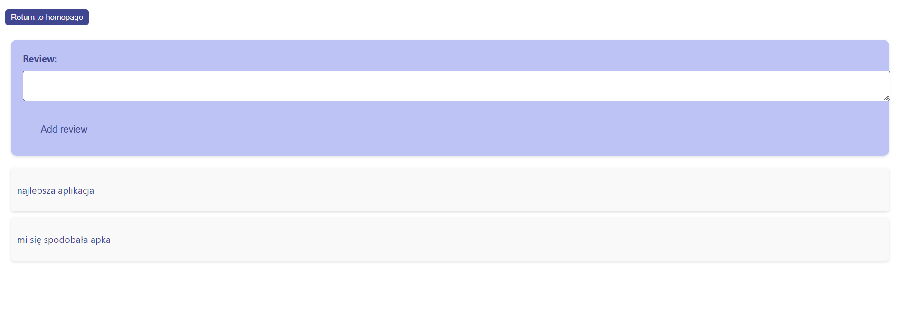
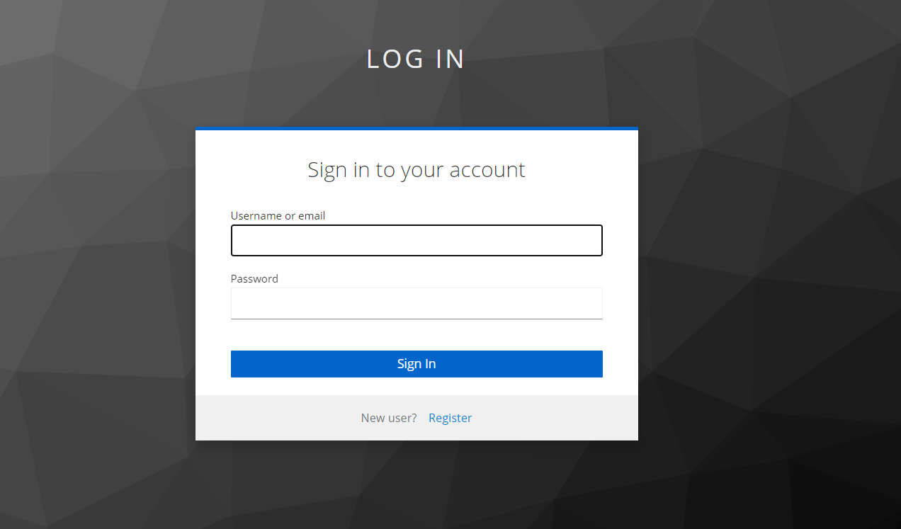

# Interslavic Dictionary Website

This project is a dictionary that translates between Interslavic and Polish languages. You can browse and read the words even if you are not logged in. Additionally, without logging in, you can leave a review about the application.

Once you log in, you can save your favorite words for easy access and review them at any time.

If you are logged in as an admin, you will have additional privileges. As an admin, you can view the saved words of all users, add new words to the dictionary, and delete existing words or reviews.

### Tech Stack

`JavaScript`  `React`  `CSS`  `JWT`  `OAuth (Keycloak)`  `Docker`  `Kubernetes`

### Run

Go to the `kubernetes` folder and run the command `kubectl apply -f .`

### Visuals 

#### Home page

#### List of words

#### Reviews

#### Login

